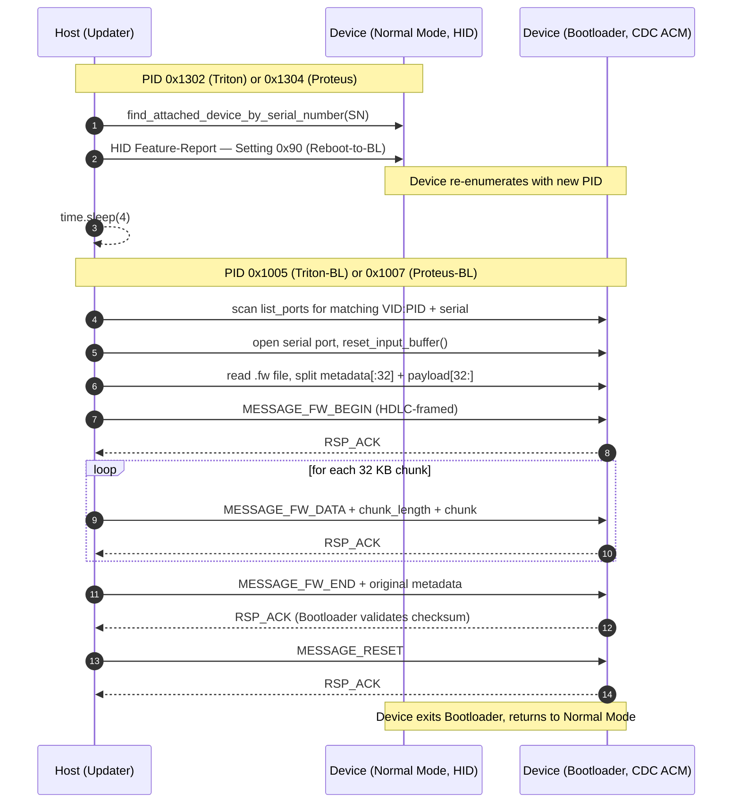
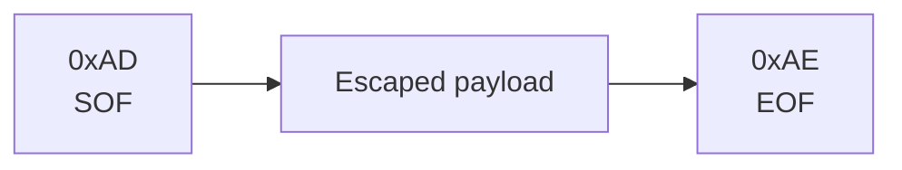
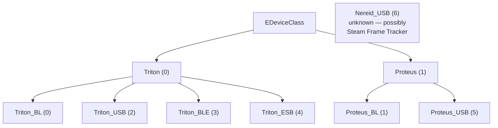

# SC2 Firmware Update Protocol (fully decoded)

> Source: `/home/deck/.local/share/Steam/bin/hardwareupdater/hardwareupdater.x86_64`
> (PyInstaller bundle, Python 3.12, bytecode extracted 2026-05-22)
> Updater version `1.5`

## TL;DR

- Steam ships **`hardwareupdater.x86_64`** with the client — a PyInstaller bundle containing the entire Triton/Proteus update logic in Python 3.12.
- Update workflow is **PREP → UPDATE → REBOOT**: HID Feature-Report `0x90` switches the device to bootloader (new USB PID), CDC ACM serial then carries HDLC-framed firmware chunks, final `MESSAGE_RESET` returns to normal mode.
- Wire framing: `SOF=0xAD`, `EOF=0xAE`, `ESCAPE=0xAC` (with escape table `0xAC|0xAD|0xAE → 0xAC 0x00|0x01|0x02`).
- Firmware files have a 32-byte header (`magic`, `payload_size`, `checksum`, 20 bytes reserved) followed by raw ARM Cortex-M payload. Magic is `0xD2D86467` for Triton, `0x2E795631` for Proteus.
- Same Feature-Report channel is used live for **read-only attribute queries**: `fr_id=2 op=0x83` returns Puck info, `fr_id=1 op=0x81` is ESB-routed to the Controller.
- Firmware static analysis suggests **Nordic nRF52840** (Triton) and **nRF52833/820** (Proteus), running **Zephyr RTOS**, built with **ARM GCC 14 + newlib** on a Jenkins CI.

## Table of Contents

- [Overview](#overview)
- [Codenames](#codenames)
- [USB IDs](#usb-ids-fully-decoded)
- [Device-Type Enum](#device-type-enum)
- [High-Level Update Sequence](#high-level-update-sequence)
- [Frame Format](#frame-format)
- [Device-Type Hierarchy](#device-type-hierarchy)
- [Transport Architecture](#transport-architecture)
- [Wire Format Details](#wire-format-details)
- [Updater Function Map](#updater-function-map)
- [Message Types](#message-types)
- [Firmware Magic Header](#firmware-magic-header)
- [Firmware File Format](#firmware-file-format)
- [Update Wire Protocol](#update-wire-protocol)
- [Live Feature-Report Channels](#live-feature-report-channels-empirically-verified)
- [Device-Info Attribute Table](#device-info-attribute-table)
- [Setting IDs](#setting-ids)
- [PyInstaller Bundle Contents](#pyinstaller-bundle-contents)
- [Local Firmware Artifacts](#local-firmware-artifacts)
- [CLI](#cli)
- [JSON Schema](#json-schema-check-for-updates)
- [Logging](#logging)
- [Firmware Internals](#firmware-internals-arm-cortex-m-static-analysis)
- [Privacy Notes](#privacy-notes)

## Overview

Steam ships a dedicated tool `hardwareupdater.x86_64` with the Steam client. It talks to the puck and controller directly via hidapi and can:
- Check for updates (`--check-for-updates`)
- Update individual devices by serial (`--update-by-serial`)
- Switch devices into bootloader mode (`--prep-by-serial`)
- Reboot out of bootloader mode (`--reboot-by-serial`)

Workflow: **PREP → UPDATE → REBOOT**.

## Codenames

| Codename | Meaning | First public mention |
|---|---|---|
| **Triton** | The controller (SC2 itself) — also called IBEX in firmware filenames | Datamined Q4 2025 ([NeoGAF](https://www.neogaf.com/threads/new-triton-steam-controller-icon-datamined.1689607/), [FRVR](https://frvr.com/blog/steam-controller-2-may-be-coming-soon-as-dataminers-discover-new-triton-codename-in-steam-update/)); also visible in SDL3 source as `SDL_hidapi_steam_triton.c` (covered by [Phoronix Nov 12 2025](https://www.phoronix.com/news/New-Steam-Controller-SDL)) |
| **Ibex** | Hardware-side codename for the SC2 (sibling to `Roy` for the Steam Frame controllers) | Datamined Nov 2024 by [Brad Lynch on X](https://x.com/SadlyItsBradley/status/1858925211363553316); also [Tom's Hardware](https://www.tomshardware.com/video-games/pc-gaming/valve-seemingly-preps-steam-controller-2-and-vr-controller-ibex-and-roy-controller-renders-spotted-in-steamvr-data-mine) |
| **Proteus** | The puck/dongle | SDL3 source (`IsProteusDongle()` function in `SDL_hidapi_steam_triton.c`); also explicitly named by [Phoronix Nov 12 2025](https://www.phoronix.com/news/New-Steam-Controller-SDL). This document adds the device-type role (`Proteus_USB = 5`, `Proteus_BL = 1`) from `hardwareupdater.py` |
| **Nereid** | **A second SC2 dongle parallel to Proteus.** SDL3 `controller_list.h` labels USB `28DE:1305` as "Valve Steam Nereid Dongle (Proprietary)" with the same `k_eControllerType_SteamControllerTriton` driver assignment as Proteus; the driver's `IsProteusDongle()` returns true for both — i.e., they share the exact same wire protocol. `hardwareupdater.py` defines `Nereid_USB = 6` in `EDeviceType` but **no `Nereid_BL`**, suggesting Steam's standalone updater doesn't yet have a bootloader path for it.<br><br>**Strongest current hypothesis** (not confirmed): Nereid is the **Steam-Machine-integrated dongle**. Evidence: (a) SDL3 added the Nereid PID on Nov 12 2025, the same week Steam Machine was announced; (b) Steam Machine is officially "a PC console under SteamOS" and will ship as a self-contained bundle — an integrated dongle (USB-internal, not a separate puck the user plugs in) would explain a parallel PID; (c) no Nereid_BL in the user-facing updater is consistent with the Steam Machine's OS handling its own integrated peripherals directly rather than via Steam-Client; (d) reusing the Proteus protocol means controllers and games work identically across Machine + standalone Puck setups. Steam Machine has been delayed (no release date as of May 2026 due to RAM shortage), which fits "PID defined ahead of launch, no public hardware yet." Alternatives: hardware-revision 2 of the Puck, region-specific SKU, OEM-licensed dongle. None as strong a fit as Steam-Machine-integrated. | SDL3 commit `1998b650452bdf0bee5209e20e4715b4295abe8c` (Sam Lantinga, Nov 12 2025); also mentioned by [Phoronix](https://www.phoronix.com/news/New-Steam-Controller-SDL) the same day |
| **Olympus** | Custom/relabeled trackpad IC at I2C `0x2C` (drivers `olympus-trackpad-left`, `olympus-trackpad-right`) | **First publicly documented here** — extracted from IBEX_FW rodata Device-Tree nodes |
| **Dragoon** | Valve-internal HAL/scheduling library — path `dragoon/libs/scheduling/src/rem_hal_event_timer.c` leaked in IBEX_FW build paths | **First publicly documented here** |
| **Roy** | Found in IBEX_FW as a thread/module name `roybex_combiner`. "Roy" is the public datamined codename for the Steam Frame VR controllers (per Tom's Hardware Q4 2025). A "Roy-Ibex combiner" thread in Triton firmware **suggests an input-bridge between Roy controllers and the SC2** — hypothesis, not confirmed | "Roy" itself is publicly datamined (Tom's Hardware Q4 2025); the integration evidence in Triton firmware is **first publicly documented here** |
| **ESB** | "Enhanced ShockBurst" — Nordic Semi proprietary 2.4 GHz wireless protocol between puck and controller | Nordic-standard, not Valve-specific |

`Deckard` (Steam Frame headset) is a separate product from the sibling SteamVR datamine — not directly relevant to Triton/SC2. Naming-pattern note: the codenames aren't uniformly themed. Triton / Proteus / Nereid are Greek sea-deities; Olympus is a Greek mountain; Ibex is wildlife; Dragoon is military; Roy is a Blade-Runner reference (matching `Deckard`). Different teams or different eras of naming.

## USB IDs (fully decoded)

| VID:PID | Device | Mode |
|---|---|---|
| `28DE:1302` | Triton (Controller) | Wired-USB, Normal Mode (HID) — labelled `Valve Steam Triton Controller` in SDL3 `controller_list.h` |
| `28DE:1303` | Triton (Controller) | **Bluetooth LE mode** — labelled `Valve Steam Triton Controller (BLE)` in SDL3 `controller_list.h`; appears in `hardwareupdater.py` `find_units_for_update` (BLE-paired controllers can be enumerated for updates) but not in `find_attached_device_by_serial_number` (BLE devices can't be opened via the same hidapi path as USB/Puck) |
| `28DE:1304` | Proteus (Puck) | Normal Mode (HID) — `Valve Steam Proteus Dongle (Proprietary)` |
| `28DE:1305` | **Nereid (separate Dongle)** | Normal Mode (HID) — `Valve Steam Nereid Dongle (Proprietary)` in SDL3 `controller_list.h`. SDL3's `IsProteusDongle()` returns true for both `0x1304` and `0x1305`, so this is a structurally parallel second SC2 dongle (role uncertain — possibly a future / SKU variant; see Codenames table) |
| `28DE:1005` | Triton (Controller) | Bootloader Mode (CDC ACM) — **first publicly documented here** |
| `28DE:1007` | Proteus (Puck) | Bootloader Mode (CDC ACM) — **first publicly documented here** |

Steam-side scan: VID=0x28DE, Usage-Page=0xFF00 (vendor-specific HID).

**Public PIDs** `0x1302`, `0x1303`, `0x1304`, **and `0x1305`** are all in SDL3 commit [1998b6504](https://github.com/libsdl-org/SDL/commit/1998b650452bdf0bee5209e20e4715b4295abe8c) by Sam Lantinga (Valve), Nov 12 2025. **Bootloader-side CDC ACM PIDs** `0x1005` and `0x1007` are not in SDL3 (grepped against current `main`); no Nereid-bootloader PID has been observed in `hardwareupdater.py` either (the `EDeviceType` enum we extracted lists `Nereid_USB = 6` but no `Nereid_BL`).

## Device-Type Enum

```c
enum EDeviceType {
    k_EDeviceType_Triton_BL  = 0,  // Controller in bootloader
    k_EDeviceType_Proteus_BL = 1,  // Puck in bootloader
    k_EDeviceType_Triton_USB = 2,  // Controller via USB-C
    k_EDeviceType_Triton_BLE = 3,  // Controller via Bluetooth
    k_EDeviceType_Triton_ESB = 4,  // Controller via puck (ESB radio)
    k_EDeviceType_Proteus_USB= 5,  // Puck via USB
    k_EDeviceType_Nereid_USB = 6,  // second SC2 dongle (PID 0x1305 in SDL3, parallel to Proteus) — see Codenames table
};

enum EDeviceClass {
    k_EDeviceClass_Triton  = 0,
    k_EDeviceClass_Proteus = 1,
};

const char* Device_Type_Strings[] = {
    "Triton BL", "Proteus BL", "Triton USB", "Triton BLE",
    "Triton ESB", "Proteus USB", "Nereid USB"
};
```

## High-Level Update Sequence



## Frame Format



**Escape rules** (inside payload):

| Byte | Escaped as |
|---|---|
| `0xAC` | `0xAC 0x00` |
| `0xAD` | `0xAC 0x01` |
| `0xAE` | `0xAC 0x02` |

## Device-Type Hierarchy



## Transport Architecture

| Mode | Transport | Devices |
|---|---|---|
| **Normal** | HID (vendor Usage-Page 0xFF00) | Triton/Proteus on USB PID 0x1302/0x1303/0x1304/0x1305 |
| **Bootloader** | **CDC ACM serial** | After `reboot_to_BL` the device re-enumerates as a virtual COM port |

Update flow:
1. Updater finds the device in **Normal Mode** via HID (PIDs 0x1302..0x1305, Usage-Page 0xFF00).
2. Updater sends **Reboot-to-BL** Feature-Report via HID.
3. Device re-enumerates as **CDC ACM** on a new PID.
4. Updater opens the COM port and sends/receives **HDLC-style frames**.
5. After successful update: **MESSAGE_RESET** over serial → device reboots.
6. Device comes back up in Normal Mode.

## Wire Format Details

Inside the bootloader, bytes are sent as framed HDLC-style packets over the serial connection:

| Constant | Value | Purpose |
|---|---|---|
| `SOF_BYTE` | `0xAD` | Start of Frame |
| `EOF_BYTE` | `0xAE` | End of Frame |
| `ESCAPE_BYTE` | `0xAC` | Escape marker for `0xAC/0xAD/0xAE` inside payload |
| `HID_LEN` | 64 | HID buffer size (used in Normal Mode for padding) |

### Escape encoding (reconstructed from `encode_msg`)

```python
def encode_msg(msg: bytes) -> bytes:
    out = bytes([SOF_BYTE])              # 0xAD
    for b in msg:
        if b == 0xAC:    out += b'\xAC\x00'    # ESCAPE + 0x00
        elif b == 0xAD:  out += b'\xAC\x01'    # ESCAPE + 0x01
        elif b == 0xAE:  out += b'\xAC\x02'    # ESCAPE + 0x02
        else:            out += bytes([b])
    out += bytes([EOF_BYTE])             # 0xAE
    return out
```

### Decoding (reconstructed from `decode_msg`)

```python
def decode_msg(buf: bytes) -> bytes:
    sof = buf.index(SOF_BYTE)            # find 0xAD
    eof = buf.index(EOF_BYTE)            # find 0xAE
    payload = buf[sof+1 : eof]
    out, escape = [], False
    for c in payload:
        if escape:
            out.append(c + 0xAC)         # 0x00→0xAC, 0x01→0xAD, 0x02→0xAE
            escape = False
        elif c == 0xAC:
            escape = True
        else:
            out.append(c)
    return bytes(out)
```

### Mode switching via HID Feature-Reports

Before the frame protocol on serial can start, the device must be put in bootloader mode via HID Feature-Reports in Normal Mode (reconstructed from `reboot_to_BL`):

| Device | Condition | Feature-Report payload | Meaning |
|---|---|---|---|
| Proteus (Puck) | `bcd_version == 2` | `pad_hid_fr(b'\x02\x90')` | Feature-Report-ID 0x02, Setting `0x90` = Reboot-to-BL |
| Proteus (Puck) | `bcd_version != 2` | `pad_hid_fr(b'\x01\x90')` | Feature-Report-ID 0x01, Setting `0x90` |
| Triton (Controller) | (always) | `pad_hid_fr(b'\x01\x90')` | Feature-Report-ID 0x01, Setting `0x90` |

Our puck has `bcdDevice 0.02` → we land on the **bcd_version == 2** path (Feature-Report 0x02).

Normal reboot (Triton only, from `reboot()`):
- `pad_hid_fr(b'\x01\x95')` — Feature-Report-ID 0x01, Setting `0x95` = Normal Reboot
- Proteus has no normal-reboot command exposed (`reboot()` returns False unless Triton).

## Updater Function Map

| Function | Args | Purpose |
|---|---|---|
| `MyHidDevice` | (class) | HID wrapper around the `hid` Python package |
| `usage` | () | Help text |
| `sanity_check_metadata` | meta | Validates update metadata |
| `get_feature_report` | device, fr_id | Generic Feature-Report read |
| `pad_hid_fr` | blob | Pad to HID_LEN (64 B) |
| `hex_to_ascii` | input | Hex string → ASCII |
| `get_str_attribute` | device, fr_id, attribute_number, op | Read a string attribute |
| `get_serial_triton` | hiddev | Controller serial number |
| `get_serial_dongle` | hiddev | Puck serial number |
| `get_build_ts_triton` | hiddev | Controller firmware timestamp |
| `get_build_ts_dongle` | hiddev | Puck firmware timestamp |
| `read_attribute_values` | device, fr_id, opcode | Generic attribute read (31 const slots) |
| `find_devices_by_PID` | PID | VID=0x28DE, Usage-Page 0xFF00 |
| `find_units_for_update` | new_triton_ts, new_proteus_ts, updateable_only | Build of the `updates_available` array |
| `get_device_class` | device_type | Triton vs Proteus mapping |
| `find_triton_device_by_serial_number` | serial | Searches PIDs 0x1302/1303/1304/1305 |
| `find_attached_device_by_serial_number` | serial | Same, but without 0x1303 |
| `reboot_to_BL` | device_class, hiddev | See mode switching above |
| `reboot` | device_class, hiddev | Normal reboot, Triton only |
| `encode_msg` | msg | See escape encoding above |
| `decode_msg` | msg | See decoding above |
| `send_msg_and_expect_ack` | s, msg | Send a frame + wait for ACK |
| `open_comport` | thecomport | Opens the CDC ACM serial port |
| `get_info_from_bootloader` | thecomport | Bootloader info query (PROVISIONING_MAGIC check) |
| `program_by_serial` | device_type, serial_number, app_filename | **Main function**: full update flow for one device |
| `prep_by_serial` | serial_number | Switch to BL |
| `reboot_by_serial` | serial_number | Exit BL |
| `program_by_type_sn` | device_type, sn | Dispatch by device type |

## Message Types

(uint16, little-endian on the wire after framing)

| Value | Symbol | Meaning |
|---|---|---|
| `0x1233` | `MESSAGE_INFO` | Query device info (version, status) |
| `0x1234` | `MESSAGE_FW_BEGIN` | Start of firmware transfer |
| `0x1235` | `MESSAGE_FW_DATA` | Firmware data chunk |
| `0x1236` | `MESSAGE_FW_END` | Commit + verify |
| `0x1237` | `MESSAGE_RESET` | Reboot command |
| `0x1238` | `MESSAGE_PROVISION` | Provisioning operation |
| `0` | `RSP_ACK` | Successful response |

## Firmware Magic Header

Each `.fw` file starts with a 4-byte magic (uint32 LE):

| Magic | File Type | Verified |
|---|---|---|
| `0x2E795631` | `PROTEUS_FW_MAGIC` | ✓ matches `31 56 79 2e` in PROTEUS_FW |
| `0xD2D86467` | `TRITON_FIRMWARE_HEADER_MAGIC` | ✓ matches `67 64 d8 d2` in IBEX_FW |
| `0xAC2C2D29` | `PROVISIONING_MAGIC` | for provisioning blobs |
| `0xE873BD47` | `MSG_PROVISION_MAGIC` | for provision messages on-wire |

## Firmware File Format

Each `.fw` file is two sections:

```c
struct FirmwareFile {
    struct FirmwareMetadata header;  // 32 bytes
    uint8_t payload[header.payload_size];  // ARM Cortex-M code + data
};

struct FirmwareMetadata {            // 32 bytes total
    uint32_t magic;                  // LE: 0xD2D86467 (Triton) | 0x2E795631 (Proteus)
    uint32_t payload_size;           // bytes after this 32-byte header (LE uint32)
    uint32_t crc32;                  // CRC32 of the payload, at offset 0x08 (validated by the BL on FW_END)
    uint32_t reserved[5];            // 20 bytes zero
};
```

The [`OpenSteamController/Ibex-Firmware`](https://github.com/OpenSteamController/Ibex-Firmware) archive project independently confirms this layout — they catalog every `.fw` blob shipped via Valve's CDN and validate the CRC32 on import.

Verified against all 4 local FW files: `total_size == 32 + payload_size` matches perfectly.

`sanity_check_metadata()` validates **only the magic**. Size and checksum validation is performed by the bootloader itself during `MESSAGE_FW_END`.

## Update Wire Protocol

Order (`program_by_serial`):

1. **Switch to BL** (HID Feature-Report in Normal Mode):
   - Proteus with bcd_version=2: `pad_hid_fr(b'\x02\x90')` (FR-ID 0x02, Setting 0x90)
   - Otherwise: `pad_hid_fr(b'\x01\x90')` (FR-ID 0x01, Setting 0x90)
2. **Wait** 4 seconds for USB re-enumeration.
3. **Find BL COM port** by iterating `serial.tools.list_ports.comports()`:
   - Triton-BL = `VID:PID=28DE:1005`
   - Proteus-BL = `VID:PID=28DE:1007`
   - Per match: `get_info_from_bootloader(port)` to verify the serial
4. **Open serial** + `reset_input_buffer()`.
5. **Read .fw file**: `metadata = data[:32]`, `payload = data[32:]`, `sanity_check_metadata(metadata)`.
6. **MESSAGE_FW_BEGIN** (ERASE): `struct.pack('<H', 0x1234)` → `send_msg_and_expect_ack(s, msg)`.
7. **Loop per 32 KB chunk** (`PROGRAMMING`):
   - `msg = struct.pack('<HH', 0x1235, len(chunk)) + chunk`
   - `send_msg_and_expect_ack(s, msg)`
   - PROGRESS print
8. **MESSAGE_FW_END** with the original metadata appended for verification:
   - `msg = struct.pack('<H', 0x1236) + fwmetadata`  (32 bytes appended)
   - `send_msg_and_expect_ack(s, msg)`
9. **MESSAGE_RESET** (`RESETTING` → SUCCESS):
   - `msg = struct.pack('<H', 0x1237)`
   - `send_msg_and_expect_ack(s, msg)`

### Frame send/receive

```python
def send_msg_and_expect_ack(s, msg):
    s.write(encode_msg(msg))                            # HDLC-encoded payload + SOF/EOF
    rsp = decode_msg(s.read_until(expected=EOF_BYTE))   # read until 0xAE, then decode
    if len(rsp) < 1 or rsp[0] != RSP_ACK:               # first byte must be 0 (ACK)
        raise FatalError(rsp)
    return rsp[1:]                                       # payload after ACK
```

## Live Feature-Report Channels (empirically verified)

Via `ioctl HIDIOCSFEATURE` + `HIDIOCGFEATURE` on hidraw9 (Puck PID 0x1304):

| Channel | fr_id | op | Routing |
|---|---|---|---|
| **Puck attributes (local)** | 2 | 0x83 | direct to puck firmware |
| **Controller attributes (ESB-routed)** | 1 | 0x81 | via ESB radio to the paired controller |
| Status query (unclear) | 1 | 0x8d | returns `type=0x89, len=3, 00 00 00` |

Query wire format: `pad_hid_fr(bytes([fr_id, op]))` (64-byte padded).

Response wire format (65-byte buffer):
```
byte 0: report_id (= fr_id)
byte 1: response_type (= echo of op, or alternate)
byte 2: response_length
byte 3..3+length: payload
```

Example **Puck response** (live):
- `01 04 13 00 00` → tag 1 (product_id), value `0x1304`
- `02 00 00 00 00` → tag 2 (capabilities), value 0
- `0a f2 f9 d2 68` → tag 10 (boot_build_timestamp), value `0x68D2F9F2` = 2025-09-23 19:50 UTC
- `04 5d d4 fb 69` → tag 4 (build_timestamp), value `0x69FBD45D` = 2026-05-06 23:53 UTC = **matches PROTEUS_FW_69FBD45D.fw**
- `09 47 00 00 00` → tag 9 (hw_id), value `0x47 = 71`

Example **Controller response** (live, ESB-routed):
- `01 02 13 00 00` → tag 1 (product_id), value `0x1302` = Triton USB-mode ID
- `02 00 00 00 00` → tag 2 (capabilities), value 0
- `0a 2e f9 d2 68` → tag 10 (boot_build_timestamp), value `0x68D2F92E` = 2025-09-23 19:49 UTC
- `04 c5 cd 27 69` → tag 4 (build_timestamp), value `0x6927CDC5` = 2025-11-19 06:55 UTC = **`current_ts` from Steam log!**
- `09 48 00 00 00` → tag 9 (hw_id), value `0x48 = 72` = **`hardware_id` from Steam log!**

→ **Confirms the "must_update" logic live**: puck is on 0x69FBD45D (the target), controller still on 0x6927CDC5 (older, must_update=true to target 0x69FE17FF).

## Device-Info Attribute Table

(from `read_attribute_values`)

Generic pattern for attribute reads via Feature-Report:
- **Send**: `pad_hid_fr(struct.pack('=bB', fr_id, opcode))`
- **Receive**: header (3 bytes: `report_type`, `report_length`, `report_bytes_offset`)
  - Then `num_attrs = report_length // 5` entries of 5 bytes each.
  - Format per entry: `<uint8 tag><uint32_LE value>`

| Tag | Attribute | Note |
|---|---|---|
| 0 | `unique_id` | uint32, device ID |
| 1 | `product_id` | uint32, product code |
| 2 | `capabilities` | uint32, bit-flags |
| 4 | `build_timestamp` | uint32, **= `current_ts` in update JSON** |
| 5 | `radio_build_timestamp` | uint32, radio FW (ESB/BLE) |
| 9 | `hw_id` | uint32, **= `hardware_id` 72 in JSON** |
| 10 | `boot_build_timestamp` | uint32, bootloader-FW TS |
| 11 | **`frame_rate`** | uint32, **the ~266 Hz we measured empirically** |
| 12 | `secondary_build_timestamp` | for 2nd component (radio IC? stick?) |
| 13 | `secondary_boot_build_timestamp` | same, BL |
| 14 | `secondary_hw_id` | same, HW |
| **15** | **`data_streaming`** | uint32, **likely the toggle for the IMU stream** |
| 16 | `trackpad_id` | uint32, trackpad variant |
| 17 | `secondary_trackpad_id` | uint32, second trackpad |

(Tags 3, 6, 7, 8 not in dispatch — reserved.)

## Setting IDs

| Setting-ID | Value | Meaning |
|---|---|---|
| `0x90` | (1 or 2) | Reboot to Bootloader |
| `0x95` | 1 | Normal Reboot (Triton only) |

Setting-IDs are sent via Feature-Report-ID `0x01` (default) or `0x02` (newer Proteus with bcd_version=2). Payload bytes: `b'<value><setting_id>'`.

## PyInstaller Bundle Contents

The `hardwareupdater.x86_64` bundle contains **only open-source modules besides `hardwareupdater.py`**:
- `hid` (PyPI package, hidapi binding)
- `serial` + `serial.tools.list_ports*` (pyserial)
- Python stdlib

No hidden Valve-internal helper modules. All SC2-specific logic is in `hardwareupdater.py`.

## Local Firmware Artifacts

Pre-update state (2026-05-22), in `~/.local/share/Steam/bin/hardwareupdater/`. Note that **Valve has shipped at least one firmware update since this snapshot** (June 2026: charging-issue fix + LED-dimming + trigger-deadzone changes), so the timestamps below are no longer the latest available.

The same firmware blobs are also distributed via Valve's CDN inside the `bins_hardware_all` zip at `https://cdn.steamstatic.com/client/`, with every Steam client update across the stable + publicbeta channels. The [`OpenSteamController/Ibex-Firmware`](https://github.com/OpenSteamController/Ibex-Firmware) project tracks that zip over time and exposes a public catalog at <https://opensteamcontroller.github.io/IbexFirmware/> — useful if you want versioned `.fw` blobs without a local Steam install.

```
IBEX_FW_69FA5889.fw      377 KB  2026-05-06  Triton (Controller)
IBEX_FW_69FE17FF.fw      348 KB  2026-05-08  Triton (mandatory update)
PROTEUS_FW_69FA587F.fw   200 KB  2026-05-06  Proteus (Puck)
PROTEUS_FW_69FBD45D.fw   199 KB  2026-05-07  Proteus (mandatory update)
hardwareupdater.cfg                          tracks current state
hardwareupdater.x86_64    7.7 MB              Python bundle (PyInstaller)
```

Filename format: `<CODENAME>_FW_<TIMESTAMP_HEX>.fw` where TIMESTAMP is the build timestamp in hex.

`hardwareupdater.cfg`:
```
MUST_UPDATE_TRITON_FW_TS:69FE17FF
MUST_UPDATE_PROTEUS_FW_TS:69FBD45D
TRITON_FW_TS:69FE17FF
PROTEUS_FW_TS:69FBD45D
```

## CLI

```
hardwareupdater.x86_64 [option]

Options:
  --help
  --check-for-updates       → JSON output (see schema below)
  --update-all              → execute all pending updates
  --update-by-serial SN     → update a specific device
  --prep-by-serial SN       → switch to bootloader mode
  --reboot-by-serial SN     → exit bootloader
  --show-all-devices
```

## JSON Schema (check-for-updates)

```json
{
  "version": "1.5",
  "updates_available": [
    {
      "type": 4,                          // EDeviceType
      "Name": "Triton ESB",               // Device_Type_Strings[type]
      "hardware_id": 72,                  // internal Steam HW ID, >= MIN_HW_ID(68)
      "serial_number": "FX-NUMBER",       // PII — redact!
      "current_ts": "0x6927CDC5",         // installed firmware build timestamp
      "update_ts": "0x69FE17FF",          // target firmware timestamp
      "must_update": true                 // mandatory flag
    }
  ]
}
```

## Logging

Steam logs all operations under `HardwareUpdate:` in `~/.local/share/Steam/logs/steamui_system.txt` and `controller.txt`. Example symbols (Steam-internal C++ class names, name-mangled):
- `CGetTritonDonglePairingBondWorkItem(slot)` — pairing-bond query per slot 0..3
- `CGetTritonSlotInfoWorkItem(slot)` — slot info query

## Firmware Internals (ARM Cortex-M static analysis)

### Hardware inference

From vector-table analysis across all 4 .fw files:

| Property | IBEX (Triton/Controller) | PROTEUS (Puck) |
|---|---|---|
| Initial SP | `0x2001_7600` / `0x2001_6d80` | `0x2001_5bc0` |
| SRAM top (inferred) | ~96 KB | ~88 KB |
| Reset-Handler offset | 0x29d08 / 0x25b14 | 0x1198d |
| Flash base (inferred) | `0x0000_0000` | `0x0000_0000` |
| Registered IRQs | 63 / 63+ | 63+ |
| ASCII printable in code | ~36% | ~30% |

**Nordic nRF52840 confirmed for BOTH Triton and Proteus** (correcting the earlier nRF52833 inference).

[iFixit and PC Gamer teardowns](https://www.ifixit.com/Device/Steam_Controller_%282nd_Generation%29) read the controller's chip markings as Nordic nRF52833, with hedged language ("appears to be"). **The firmware tells a different story.** The IBEX_FW rodata contains Zephyr Device-Tree node addresses that the firmware reads/writes against — these have to match the real silicon for the device to work. The decisive ones:

| DT node | Address | nRF register | Significance |
|---|---|---|---|
| `gpio@50000300` | `0x50000300` | **GPIO Port P1** | Only nRF52840 has a second GPIO port (P1). nRF52833/52820/52811 have P0 only. |
| `i2s@40025000` | `0x40025000` | **I2S Peripheral** | I2S is exclusive to nRF52840 in the nRF52 series. |
| `clock@40000000`, `uart@40002000`, `i2c@40003000`/`@40004000`, `adc@40007000`, `timer@40009000`/`@4001a000`, `temp@4000c000`, `random@4000d000`, `watchdog@40010000`, `pwm@4001c000`/`@40021000`/`@40022000`, `flash-controller@4001e000`, `gpio@50000000` | various | Standard nRF52 family | Match nRF52 register map; consistent with nRF52840 (and others) |

Plus the driver names confirm the Nordic SDK: `adc_nrfx_saadc`, `i2c_nrfx_twim`, `pwm_nrfx`, `uart_nrfx_uarte` — all from the nRFx HAL.

Vector-table stats (for completeness):

| Property | IBEX (Triton/Controller) | PROTEUS (Puck) |
|---|---|---|
| Initial SP | `0x2001_7600` / `0x2001_6d80` | `0x2001_5bc0` |
| Reset-Handler offset | `0x29d08` / `0x25b14` | `0x1198d` |
| Flash base | `0x0000_0000` | `0x0000_0000` |
| Registered IRQs | 63 / 63+ | 63+ |

Both stack-tops fit comfortably within the nRF52840's 256 KB SRAM — the smaller stack on the Puck just reflects the smaller firmware (no IMU, no trackpads, no battery management to handle). **The Puck (Proteus) is also nRF52840** based on the same DT-address evidence in PROTEUS_FW rodata (`gpio@50000300` is present).

**Why this matters:** iFixit's chip-marking read was hedged. Firmware-DT addresses are authoritative — the silicon must respond to those exact register addresses or the firmware wouldn't function. We're tagging this as a correction of the public iFixit / PC Gamer claim, not a contradiction of our previous static-analysis position, which was already "consistent with both 833 and 840".

### Standard Cortex-M vector table

Bytes 0x20..0x21F in the file are the standard ARM vector table:
- Word 0: Initial SP
- Word 1: Reset_Handler (Thumb bit set = address is odd)
- Word 2..15: System exceptions (NMI, HardFault, MemManage, BusFault, UsageFault, SVCall, DebugMonitor, PendSV, SysTick)
- Word 16+: NVIC IRQ handlers (device-specific, up to 64+ on nRF52)

The unused "Reserved" slots (7, 8, 9, 10, 13) are all 0 — standard compliance.

Many IRQs share the same handler — typical pattern when the firmware author only actively uses certain peripherals and the rest point to a default handler.

### Build-Identifier at a fixed offset

All FW files have a 12-char hex string at **file offset `0x012c` (payload offset 0x10C)**:

| File | Build hash |
|---|---|
| IBEX_FW_69FA5889 | `817236e593fa` |
| IBEX_FW_69FE17FF | `e259dc6bcab5` |

Very likely the **start of the Git commit SHA** (12 chars equals typical `git log --format=%h` output) used as build-provenance marker. Confirmed by the boot banner `"Starting Triton BUILD_TIME_%08x GIT_SHA_%s"`.

### What static analysis NOW shows

With `tools/analyze_fw.py` (pure Python: function-prolog detection + BL-target tracking + rodata-region finder + string extraction):

**IBEX_FW (Triton) – code stats:**
- ~2,000 function prologs (PUSH instructions)
- ~7,500 BL (Branch-with-Link) call sites
- 25 KB rodata region, **857 real strings**

**PROTEUS_FW (Puck) – code stats:**
- 445 strings in rodata
- Build path leaked: `'/data/jenkins/workspace/GNU-toolchain/arm-14/src/newlib-cygwin/newlib/'` → **ARM GCC 14 + newlib + Jenkins CI**

### External I2C peripherals (Triton)

DT-node analysis of IBEX_FW reveals the complete I2C bus map:

| I2C addr | DT-node name | Real chip | Function |
|---|---|---|---|
| `0x10` | `slg4l48185@10` | **Renesas/Dialog SLG4L48185** | GreenPAK programmable mixed-signal IC. Driver `gpio_greenpak` uses it as an I2C-controlled GPIO expander (likely for power-sequencing or puck-pairing pin debouncing). |
| `0x2C` | `olympus@2c` | **Olympus** (Valve-internal codename — likely custom or relabeled silicon) | Trackpad controller for both left + right trackpads (drivers `olympus-trackpad-left`, `olympus-trackpad-right`). |
| `0x4B` | `mp2733@4b` | **MPS MP2733** | USB-PD-capable battery charger + fuel-gauge combo, BC1.2-compliant. Confirms the `"MP2733"` and `"BC1.2 result callback"` strings we found earlier; the `"Fuel gauge device is not ready"` string is from this chip's init code (the MP2733 has a built-in fuel-gauge — no separate IC). |
| `0x6A` | `lsm6dsv16x@6a` | **ST LSM6DSV16X** | 6-axis IMU (3D gyro + 3D accelerometer) with embedded **Smart Fusion Engine** that outputs quaternions directly. Released by ST in 2024. Exact part number leaked in the error string `"Failed to set LSM6D's moutning matrix"` (sic — typo from Valve's firmware author). This chip is what fills the `sGyroQuatW/X/Y/Z` fields in `TritonMTUFull_t.imu` — the SDL3 comment "the controller can do its own sensor fusion" refers to this on-chip engine, not firmware-side code. |

### Other hardware components identified from string analysis

| String found | Component |
|---|---|
| `"cal/rgbw_w"`, `"cal/rgbw_b/g/r"` | RGBW LEDs with per-channel calibration (status indicator?). SDL3 doesn't expose LED control, but the firmware has it — see `ID_SET_LED_COLOR` in the Operation IDs section below. |
| `"grip touch threshold failed to retrieve"` | Grip-touch sensors (the LSM6DSV16X has touch-sense capability — these are the Grip Sense capacitive bits in the buttons mask: `0x10000000` / `0x20000000`) |
| `"PILOT_SENSE input"`, `"puck-pilot-gpio"` | Pilot-line GPIOs for puck-docking detection (signal that the controller is mounted on the magnetic Puck) |

### Proteus-side hardware (Puck)

PROTEUS_FW has a different, much smaller DT map — confirms what's NOT on the Puck:
- **No** `lsm6dsv16x` node — no IMU on the Puck
- **No** `mp2733` node — no battery charger
- **No** `olympus` node — no trackpads
- **Has** `ec-button-interface@50` at I2C `0x50` — likely a small Embedded Controller / button-readout IC for the Puck's physical buttons (pairing button)
- **Has** logical nodes `esb-controller@0..3` (matching SDL3 driver expectation of 4 slots) and `ec-input-tap@0..3` (input-tap slots, one per slot)
- **Has** `udc_nrfx` (USB Device Controller driver) and `i2c_nrfx_twis` (I2C **slave** mode) — Puck acts as I2C slave on at least one bus, presumably to expose itself to a host MCU when docked
- Plus the standard nRF52840 peripherals (`gpio@50000300`, `usbd@40027000`, etc.)

### RTOS + SDK + toolchain — exact versions

Boot-banner strings in `IBEX_FW_69FA5889.fw` give pinpoint versioning:

- `"*** Using Zephyr OS v3.7.99-93ba569c5b31 ***"` — **Zephyr v3.7.99** with Git commit `93ba569c5b31` (a pre-release between v3.7 and v3.8)
- `"*** Using nRF Connect SDK v2.9.0-d93dcad627bd ***"` — **Nordic nRF Connect SDK v2.9.0** with Git commit `d93dcad627bd`
- Both Git commits are upstream-verifiable: clone the Zephyr or NCS repo and `git show <hash>`.

Plus from earlier analysis:
- **Build system**: Zephyr's `west` build tool (`WEST_TOPDIR` referenced in build paths)
- **Toolchain**: ARM GCC 14 + newlib, built on Jenkins (`/data/jenkins/workspace/GNU-toolchain/arm-14/src/newlib-cygwin/newlib/`)
- **Internal HAL**: `dragoon/libs/scheduling/src/rem_hal_event_timer.c` — `Dragoon` is a Valve-internal repository feeding into the Triton firmware build. Nothing public; first surfaced here.

Confirming Zephyr patterns (independent of the boot banner) include `/settings/...` hierarchical paths, `"device not ready"` init errors, and a long list of `nrfx_*` driver names. Both IBEX and PROTEUS firmwares share the same Zephyr/NCS/toolchain combo.

### Code module names + threads

| Module / Thread | Role |
|---|---|
| `controller_state_machine_thread` | Main SMF dispatcher (state-machine framework loop) |
| `esb_thread` | ESB radio worker |
| `bt_rpt_thread` | Bluetooth report sender |
| `inact_monitor` | Inactivity monitor (sleep after idle) |
| `rgbled_test_thread` | RGB-LED test routine |
| `bg_work`, `usbd_workq` | Zephyr work queues |
| `ibex_input`, `ibex_loop` | IBEX-specific input handling |
| `ibexesb_common` | **NEW in newer IBEX build** — common ESB code shared between modes. Suggests recent refactoring to support multiple ESB dongle types (Proteus + Nereid). |
| `roybex_combiner` | **Hypothesis: input-aggregator thread between Roy (Steam Frame VR controller) and Ibex (SC2).** Only mention of "Roy" found in any Triton firmware. Plausible interpretations: VR-scenario where SC2 inputs are combined with Roy controller inputs; or a future cross-product bridge. **Not confirmed** — would need either disassembly of the function or Steam Frame to launch and behave consistently with this hypothesis. |
| `controller_settings` | Settings persistence |
| `hid_proxy` (PROTEUS only) | HID-report proxying — see "HID-proxy architecture on the puck" section below |

### Boot banner

Both firmwares log on start:
- Triton: `"Starting Triton BUILD_TIME_%08x GIT_SHA_%s"`
- Proteus: `"Starting Proteus BUILD_TIME_%08x GIT_SHA_%s"`

The `GIT_SHA_%s` matches our hypothesis — the **12-char hex string at offset 0x012C** in the FW header is the Git commit SHA.

### ESB protocol details (from Proteus rodata)

From PROTEUS_FW strings:
- `"esb-controller@0"` through `"esb-controller@3"` → confirms the **4 controller slots** in the puck (matches exactly our 4 hidraw9-12 slots!)
- `"Cost function scaling factors {distance:%d PER:%d RSSI_IIR:%d RSSI_PEAK:%d}"` → ESB link-quality metrics:
  - **PER** = Packet Error Rate
  - **RSSI_IIR** = IIR-filtered signal strength
  - **RSSI_PEAK** = peak signal strength
- `"channel_cost_show"`, `"background_rssi_show"` → frequency channel hopping with background scanning

### Build hash confirmed as Git SHA

| File | Build hash (at offset 0x012C) | Likely `git log --format=%h` source |
|---|---|---|
| IBEX_FW_69FA5889 | `817236e593fa` | (Triton repo) |
| IBEX_FW_69FE17FF | `e259dc6bcab5` | (Triton repo) |

Directly confirmed by `"Starting Triton BUILD_TIME_%08x GIT_SHA_%s"`.

## State machines (decoded from `ST_*_entry` names)

### Wireless-mode keychord — 4 user-switchable modes

The controller exposes a button-combination ("keychord") for switching wireless modes:

| State | Wireless mode |
|---|---|
| `ST_PUCK_KEYCHORD_BT_entry` | Bluetooth LE |
| `ST_PUCK_KEYCHORD_ESB_entry` | Standard Proteus puck (ESB) |
| `ST_PUCK_KEYCHORD_ESB_ALT_entry` | **Alternative ESB** — hypothesis: the Nereid pairing path |
| `ST_PUCK_KEYCHORD_CURRENT_entry` | Re-use last-selected mode |

Same set exists with `ST_BATTERY_*_entry` prefix (parallel states while on battery, i.e. wireless).

The `ESB_ALT` state is **independent evidence** that Triton firmware was designed from the start to support two distinct ESB dongles — consistent with SDL3's `IsProteusDongle()` returning true for both Proteus (`0x1304`) and Nereid (`0x1305`) PIDs.

### Power / USB state machine

```
ST_INITIAL_entry
ST_USB_WAIT_FOR_ENUMERATION_entry
ST_USB_DATA_entry
ST_USB_SUSPENDED_entry
ST_USB_WAIT_FOR_WAKEUP_entry
ST_USB_WIRELESS_OFF_entry
ST_USB_WIRELESS_ON_entry
ST_BATTERY_entry
ST_REBOOT_entry
ST_REBOOT_SILENT_entry
ST_SHUTDOWN_entry
ST_SHUTDOWN_SILENT_entry
ST_SHUTDOWN_KEYLOCK_ACTIVE_entry
ST_SHUTDOWN_LOW_BATT_entry
```

14 states, with two flavours each of reboot (visible vs silent) and shutdown (visible/silent/keylock-active/low-battery).

## Operation IDs (additional, from `%s: GET/SET: ID_*` format strings in IBEX_FW)

Beyond the shared `FeatureReportMessageIDs` enum (covered in [`SDL3_REFERENCE.md`](SDL3_REFERENCE.md)), the Triton firmware's internal log strings reveal additional operation IDs not present in SDL3:

| ID name | Action |
|---|---|
| `ID_GET_ATTRIBUTES_VALUES` | Generic attribute read (= the `op=0x83` we use) |
| `ID_GET_STRING_ATTRIBUTE` | String attribute read (serial, etc.) |
| `ID_GET_SETTINGS_VALUES` / `ID_SET_SETTINGS_VALUES` | Read / write settings |
| `ID_LOAD_DEFAULT_SETTINGS_VALUES` | Factory-reset settings |
| `ID_GET_BATTERY_DATA` | Battery voltage / current / temperature query |
| **`ID_GET_LED_COLOR` / `ID_SET_LED_COLOR`** | **Firmware-level LED control.** Discovered here via the IBEX_FW `ID_*` format strings; Valve subsequently exposed LED dimming in the Steam Settings UI as part of the June 2026 firmware-update release (per [GamingOnLinux coverage](https://www.gamingonlinux.com/2026/06/latest-steam-update-brings-steam-controller-firmware-updates-and-bug-fixes/)), confirming the path. SDL3 itself still returns `SDL_Unsupported()` for `SetJoystickLED`. |
| `ID_GET_USER_STORE` | Per-user persistent data storage |
| `ID_FIRMWARE_UPDATE_REBOOT` | Reboot to enter firmware update (the `Setting 0x90` path) |
| **`ID_REBOOT_INTO_ISP`** | **Alternative bootloader-switch path** — In-System Programming reboot. A second route into the bootloader, distinct from the `Setting 0x90` Feature-Report we documented in the "Update Wire Protocol" section. |
| `ID_TURN_OFF` | Power-down |

## Settings subsystem (Zephyr `settings/` paths)

Concrete settings paths leaked in error strings:

```
settings/haptics/enabled
settings/haptics/amplifier_mode
settings/haptics/haptic_master_gain_db
settings/sensors/imu
settings/sensors/imu/mode
settings/sensors/imu/mounting_matrix
```

`settings/sensors/imu/mounting_matrix` is the 3×3 rotation matrix telling the firmware how the LSM6DSV16X is physically oriented inside the chassis (likely stored as 9 int16 or float values).

Five sub-tree namespaces appear in `"Failed to delete X settings"` errors:
- `bt settings` — Bluetooth bond + identity storage
- `debug settings`
- `esb settings` — ESB pairing
- `mte settings` — unknown acronym (NOT ARM Memory Tagging Extension — nRF52 is ARMv7-M with no MTE support). Possibly a Valve-internal abbreviation
- `user settings`

## HID-proxy architecture (PROTEUS)

The Puck transparently proxies HID reports from each connected Triton. Strings in PROTEUS_FW:
- `HID_PROXY_0`, `HID_PROXY_1`, `HID_PROXY_2`, `HID_PROXY_3` — one proxy endpoint per ESB slot
- `hid_proxy` module + `hid-puck` DT-node-like name
- `"Failed to register a HID proxy tap %d"` — proxy "tap" registration error per slot

This **confirms** our empirical observation of `/dev/hidraw9..12` mapping to the 4 ESB slots, plus `hidraw13` being the puck's own status / control endpoint (the `hid-puck` DT-node).

## Per-slot state machine + bond storage (PROTEUS)

Each of the 4 ESB slots tracks its own state with per-slot log strings:

| State | Example string |
|---|---|
| Idle | `Slot %u : Idle` |
| Pairing | `Slot %u : Pairing`, `Slot %u: Pairing successful` |
| Connecting | `Slot %u : Connecting Ibex %s` |
| Connected | `Slot %u : Connected Ibex %s (Ch %u)` |
| Bond saved | `Slot %u : New bond saved`, `Slot %u : Bond deleted` |
| Disconnect | `Slot %u : Disconnect message`, `Slot %u : Connection timeout` |
| Host suspended | `Slot %u : Host suspended - waiting for wakeup` / `Host did not wakeup within timeout` / `Host suspended, turn off controller` |
| Host awake | `Slot %u : Host awake` |
| Protocol negotiation | `Slot %u : Sending protocol version: %u %u` / `Protocol version updated %u` / `Unrecognized protocol version %u` |
| QoS report | `Slot %u : QOS %u {%03u %03u %03u %02u %03d} {%02u %02u %u}` — multi-field QoS metric format, partly link-quality |

Bond storage paths in the Zephyr settings subsystem:
- `esb/bond` — primary bond (slot's main pairing)
- `esb/bond_2` — **secondary bond** (matches the GamersNexus-reported "controller remembers 2 puck pairings" spec)
- `bonds` — bond list
- `bt/keys` — Bluetooth key storage

Per-instance UUIDs printed for debugging:
- `ibex%d_proteus_uuid : 0x%08X` — Controller-to-Puck pairing UUID (slot N)
- **`ibex%d_ibex_uuid : 0x%08X`** — **Controller-to-Controller pairing UUID** (one Triton bonded to another Triton). Suggests Triton firmware has paths for direct controller-to-controller communication, not just controller-to-puck. Unconfirmed what this is used for — possibly multiplayer-mode pairing or chord-input bridging.

## PROTEUS debug UART shell (physical-pin access)

PROTEUS_FW contains strings indicating a **hidden UART debug shell**:
- `shell.shell_uart`, `shell_uart_backend` — Zephyr's shell subsystem over UART
- Commands include:
  - `radio_send_channels <timeout_s> [channels]` — transmit burst on specific RF channels
  - `channel_cost_show` — dump the channel-cost table
  - `background_rssi_show` (alias `bg_rssi`) — dump the background RSSI map

UART pins exist physically on the Puck PCB. Accessing them requires hardware probing (soldering or a pogo-pin jig). Useful for ESB-radio characterisation.

## Version-to-version firmware diffs

### PROTEUS: `69FA587F` (older) vs `69FBD45D` (newer, mandatory update)

- **Total size**: 199,520 → 199,312 bytes (-208 B)
- **Payload size header**: `0x30b40 → 0x30a70`
- **Checksum header**: `0x172e95d0 → 0x5c8d6a55` (fully different content)
- **5,659 contiguous diff blocks** across the file — not a single bug-fix region but a full recompile
- **Zero strings added or removed** — feature surface unchanged
- **Function prologs**: +5 (852 → 857) — minor restructure
- **BL call sites**: identical (2,955)
- **Reset handler shifted**: `0x0001198D → 0x00011899` (~244 bytes earlier in flash)

Largest single diff block: **`0x022CE1..0x022E9F` (446 bytes)**. This is in the rodata-adjacent code region near the `channel_cost_show` / `background_rssi_show` strings, so a plausible interpretation is **a bug-fix in the ESB channel-cost-computation function**. The signature (no string changes, many small diffs, two pointer-table tweaks at file end) matches a typical point-release: a single helper-function fix that triggered linker re-layout but no semantic changes elsewhere.

### IBEX: `69FA5889` (older, verbose) vs `69FE17FF` (newer, stripped)

- Payload **−29,764 bytes** (~30 KB smaller)
- **374 strings removed** in newer build, **11 added**
- Removed strings are mostly Zephyr debug/log strings (BLE stack verbose, IMU debug printf, RGB-LED test, settings-store telemetry)

The ~8% size reduction is consistent with flipping `LOG_LEVEL` from `LOG_LEVEL_DBG` (4) to `LOG_LEVEL_INF` (3) in a Zephyr Kconfig — a one-line release-build change.

The 11 added strings include several short scrambled-looking strings: `zohejfglakpk`, `zyscmlipekno`, `}llkjyjtg]vo`, `~tnhuskjekzw{`. Possibly compiler-generated lookup tables or string-obfuscation — worth a separate investigation (XOR / shift analysis). The other added strings are mostly function/module names like `ibexesb_common` and `smf_set_state` — suggests minor API additions.

## What static analysis could still bring

- **Capstone disassembly** of specific functions (e.g. the ESB cost-function near offset `0x022CE1`)
- **`.bss` section size** — derivable from `(initial_sp - SRAM_top)`
- **Decoding the 11 scrambled strings** in newer IBEX — XOR-with-rolling-offset / Caesar shift / lookup-table analysis
- **PROTEUS UART shell** — physical probe of the Puck PCB UART pins, then `radio_send_channels` + `channel_cost_show` for live ESB characterisation

## Privacy Notes

- Serial numbers (`FX*`) are device-unique → redact when sharing docs
- `hardwareupdater.cfg` is not PII, but it captures the current update state
- USB iSerial strings of the devices should also be redacted
