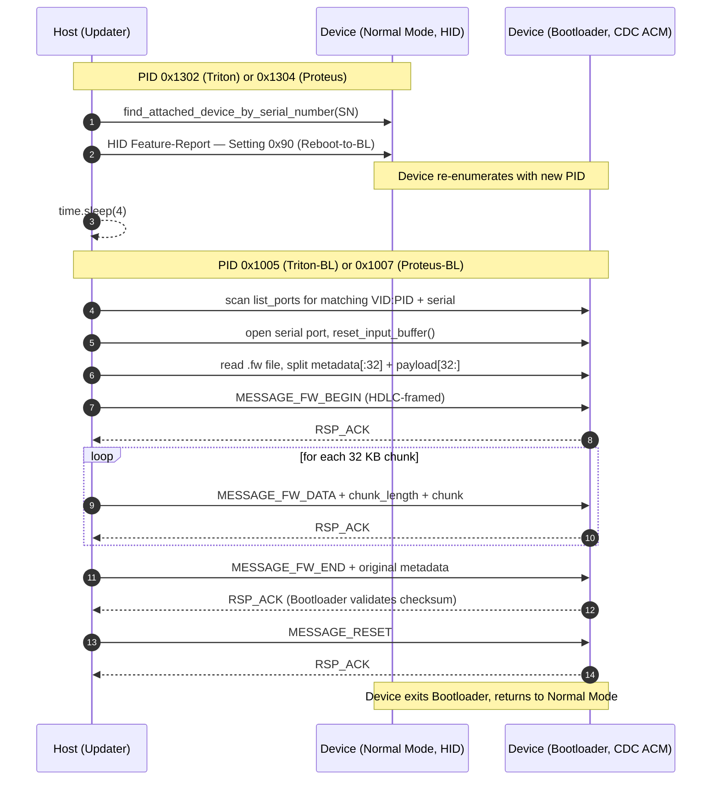
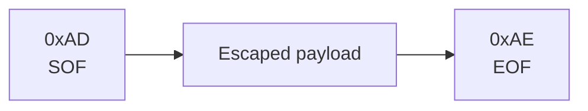
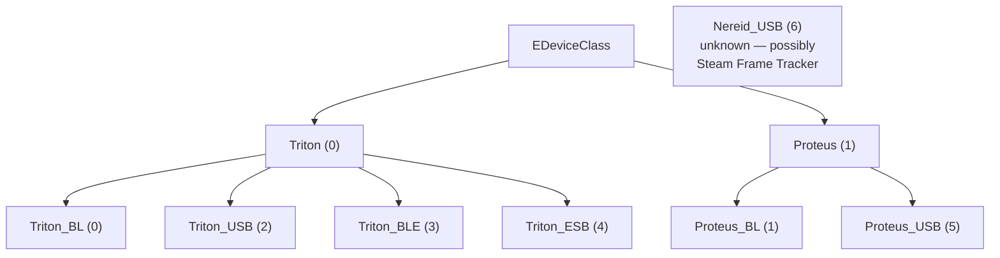

# SC2 Firmware Update Protocol (fully decoded)

> Source: `/home/deck/.local/share/Steam/bin/hardwareupdater/hardwareupdater.x86_64`
> (PyInstaller bundle, Python 3.12, bytecode extracted 2026-05-22)
> Updater version `1.5`

## TL;DR

- Steam ships **`hardwareupdater.x86_64`** with the client — a PyInstaller bundle containing the entire Triton/Proteus update logic in Python 3.12.
- Update workflow is **PREP → UPDATE → REBOOT**: HID Feature-Report `0x90` switches the device to bootloader (new USB PID), CDC ACM serial then carries HDLC-framed firmware chunks, final `MESSAGE_RESET` returns to normal mode.
- Wire framing: `SOF=0xAD`, `EOF=0xAE`, `ESCAPE=0xAC` (with escape table `0xAC|0xAD|0xAE → 0xAC 0x00|0x01|0x02`).
- Firmware files have a 32-byte header (`magic`, `payload_size`, `checksum`, 20 bytes reserved) followed by raw ARM Cortex-M payload. Magic is `0xD2D86467` for Triton, `0x2E795631` for Proteus.
- Same Feature-Report channel is used live for **read-only attribute queries**: `fr_id=2 op=0x83` returns Puck info, `fr_id=1 op=0x81` is ESB-routed to the Controller.
- Firmware static analysis suggests **Nordic nRF52840** (Triton) and **nRF52833/820** (Proteus), running **Zephyr RTOS**, built with **ARM GCC 14 + newlib** on a Jenkins CI.

## Table of Contents

- [Overview](#overview)
- [Codenames](#codenames)
- [USB IDs](#usb-ids-fully-decoded)
- [Device-Type Enum](#device-type-enum)
- [High-Level Update Sequence](#high-level-update-sequence)
- [Frame Format](#frame-format)
- [Device-Type Hierarchy](#device-type-hierarchy)
- [Transport Architecture](#transport-architecture)
- [Wire Format Details](#wire-format-details)
- [Updater Function Map](#updater-function-map)
- [Message Types](#message-types)
- [Firmware Magic Header](#firmware-magic-header)
- [Firmware File Format](#firmware-file-format)
- [Update Wire Protocol](#update-wire-protocol)
- [Live Feature-Report Channels](#live-feature-report-channels-empirically-verified)
- [Device-Info Attribute Table](#device-info-attribute-table)
- [Setting IDs](#setting-ids)
- [PyInstaller Bundle Contents](#pyinstaller-bundle-contents)
- [Local Firmware Artifacts](#local-firmware-artifacts)
- [CLI](#cli)
- [JSON Schema](#json-schema-check-for-updates)
- [Logging](#logging)
- [Firmware Internals](#firmware-internals-arm-cortex-m-static-analysis)
- [Privacy Notes](#privacy-notes)

## Overview

Steam ships a dedicated tool `hardwareupdater.x86_64` with the Steam client. It talks to the puck and controller directly via hidapi and can:
- Check for updates (`--check-for-updates`)
- Update individual devices by serial (`--update-by-serial`)
- Switch devices into bootloader mode (`--prep-by-serial`)
- Reboot out of bootloader mode (`--reboot-by-serial`)

Workflow: **PREP → UPDATE → REBOOT**.

## Codenames

| Codename | Meaning |
|---|---|
| **Triton** | The controller (SC2 itself) — also called IBEX in firmware filenames |
| **Proteus** | The puck/dongle |
| **Nereid** | Unknown — possibly Steam Frame Tracker or other upcoming Valve hardware |
| **IBEX** | Filename prefix for Triton firmware (`IBEX_FW_*.fw`) |
| **ESB** | "Enhanced ShockBurst" — Nordic Semi 2.4 GHz wireless protocol between puck and controller |

## USB IDs (fully decoded)

| VID:PID | Device | Mode |
|---|---|---|
| `28DE:1302` | Triton (Controller) | Wired-USB, Normal Mode (HID) |
| `28DE:1303` | Triton (Controller) | Variant — likely BL indicator (seen in `find_units_for_update`, missing in `find_attached_device_by_serial_number`) |
| `28DE:1304` | Proteus (Puck) | Normal Mode (HID) |
| `28DE:1305` | Proteus (Puck) | Bootloader Mode (HID side) |
| `28DE:1005` | Triton (Controller) | Bootloader Mode (CDC ACM) |
| `28DE:1007` | Proteus (Puck) | Bootloader Mode (CDC ACM) |

Steam-side scan: VID=0x28DE, Usage-Page=0xFF00 (vendor-specific HID).

## Device-Type Enum

```c
enum EDeviceType {
    k_EDeviceType_Triton_BL  = 0,  // Controller in bootloader
    k_EDeviceType_Proteus_BL = 1,  // Puck in bootloader
    k_EDeviceType_Triton_USB = 2,  // Controller via USB-C
    k_EDeviceType_Triton_BLE = 3,  // Controller via Bluetooth
    k_EDeviceType_Triton_ESB = 4,  // Controller via puck (ESB radio)
    k_EDeviceType_Proteus_USB= 5,  // Puck via USB
    k_EDeviceType_Nereid_USB = 6,  // unknown — Steam Frame Tracker?
};

enum EDeviceClass {
    k_EDeviceClass_Triton  = 0,
    k_EDeviceClass_Proteus = 1,
};

const char* Device_Type_Strings[] = {
    "Triton BL", "Proteus BL", "Triton USB", "Triton BLE",
    "Triton ESB", "Proteus USB", "Nereid USB"
};
```

## High-Level Update Sequence



## Frame Format



**Escape rules** (inside payload):

| Byte | Escaped as |
|---|---|
| `0xAC` | `0xAC 0x00` |
| `0xAD` | `0xAC 0x01` |
| `0xAE` | `0xAC 0x02` |

## Device-Type Hierarchy



## Transport Architecture

| Mode | Transport | Devices |
|---|---|---|
| **Normal** | HID (vendor Usage-Page 0xFF00) | Triton/Proteus on USB PID 0x1302/0x1303/0x1304/0x1305 |
| **Bootloader** | **CDC ACM serial** | After `reboot_to_BL` the device re-enumerates as a virtual COM port |

Update flow:
1. Updater finds the device in **Normal Mode** via HID (PIDs 0x1302..0x1305, Usage-Page 0xFF00).
2. Updater sends **Reboot-to-BL** Feature-Report via HID.
3. Device re-enumerates as **CDC ACM** on a new PID.
4. Updater opens the COM port and sends/receives **HDLC-style frames**.
5. After successful update: **MESSAGE_RESET** over serial → device reboots.
6. Device comes back up in Normal Mode.

## Wire Format Details

Inside the bootloader, bytes are sent as framed HDLC-style packets over the serial connection:

| Constant | Value | Purpose |
|---|---|---|
| `SOF_BYTE` | `0xAD` | Start of Frame |
| `EOF_BYTE` | `0xAE` | End of Frame |
| `ESCAPE_BYTE` | `0xAC` | Escape marker for `0xAC/0xAD/0xAE` inside payload |
| `HID_LEN` | 64 | HID buffer size (used in Normal Mode for padding) |

### Escape encoding (reconstructed from `encode_msg`)

```python
def encode_msg(msg: bytes) -> bytes:
    out = bytes([SOF_BYTE])              # 0xAD
    for b in msg:
        if b == 0xAC:    out += b'\xAC\x00'    # ESCAPE + 0x00
        elif b == 0xAD:  out += b'\xAC\x01'    # ESCAPE + 0x01
        elif b == 0xAE:  out += b'\xAC\x02'    # ESCAPE + 0x02
        else:            out += bytes([b])
    out += bytes([EOF_BYTE])             # 0xAE
    return out
```

### Decoding (reconstructed from `decode_msg`)

```python
def decode_msg(buf: bytes) -> bytes:
    sof = buf.index(SOF_BYTE)            # find 0xAD
    eof = buf.index(EOF_BYTE)            # find 0xAE
    payload = buf[sof+1 : eof]
    out, escape = [], False
    for c in payload:
        if escape:
            out.append(c + 0xAC)         # 0x00→0xAC, 0x01→0xAD, 0x02→0xAE
            escape = False
        elif c == 0xAC:
            escape = True
        else:
            out.append(c)
    return bytes(out)
```

### Mode switching via HID Feature-Reports

Before the frame protocol on serial can start, the device must be put in bootloader mode via HID Feature-Reports in Normal Mode (reconstructed from `reboot_to_BL`):

| Device | Condition | Feature-Report payload | Meaning |
|---|---|---|---|
| Proteus (Puck) | `bcd_version == 2` | `pad_hid_fr(b'\x02\x90')` | Feature-Report-ID 0x02, Setting `0x90` = Reboot-to-BL |
| Proteus (Puck) | `bcd_version != 2` | `pad_hid_fr(b'\x01\x90')` | Feature-Report-ID 0x01, Setting `0x90` |
| Triton (Controller) | (always) | `pad_hid_fr(b'\x01\x90')` | Feature-Report-ID 0x01, Setting `0x90` |

Our puck has `bcdDevice 0.02` → we land on the **bcd_version == 2** path (Feature-Report 0x02).

Normal reboot (Triton only, from `reboot()`):
- `pad_hid_fr(b'\x01\x95')` — Feature-Report-ID 0x01, Setting `0x95` = Normal Reboot
- Proteus has no normal-reboot command exposed (`reboot()` returns False unless Triton).

## Updater Function Map

| Function | Args | Purpose |
|---|---|---|
| `MyHidDevice` | (class) | HID wrapper around the `hid` Python package |
| `usage` | () | Help text |
| `sanity_check_metadata` | meta | Validates update metadata |
| `get_feature_report` | device, fr_id | Generic Feature-Report read |
| `pad_hid_fr` | blob | Pad to HID_LEN (64 B) |
| `hex_to_ascii` | input | Hex string → ASCII |
| `get_str_attribute` | device, fr_id, attribute_number, op | Read a string attribute |
| `get_serial_triton` | hiddev | Controller serial number |
| `get_serial_dongle` | hiddev | Puck serial number |
| `get_build_ts_triton` | hiddev | Controller firmware timestamp |
| `get_build_ts_dongle` | hiddev | Puck firmware timestamp |
| `read_attribute_values` | device, fr_id, opcode | Generic attribute read (31 const slots) |
| `find_devices_by_PID` | PID | VID=0x28DE, Usage-Page 0xFF00 |
| `find_units_for_update` | new_triton_ts, new_proteus_ts, updateable_only | Build of the `updates_available` array |
| `get_device_class` | device_type | Triton vs Proteus mapping |
| `find_triton_device_by_serial_number` | serial | Searches PIDs 0x1302/1303/1304/1305 |
| `find_attached_device_by_serial_number` | serial | Same, but without 0x1303 |
| `reboot_to_BL` | device_class, hiddev | See mode switching above |
| `reboot` | device_class, hiddev | Normal reboot, Triton only |
| `encode_msg` | msg | See escape encoding above |
| `decode_msg` | msg | See decoding above |
| `send_msg_and_expect_ack` | s, msg | Send a frame + wait for ACK |
| `open_comport` | thecomport | Opens the CDC ACM serial port |
| `get_info_from_bootloader` | thecomport | Bootloader info query (PROVISIONING_MAGIC check) |
| `program_by_serial` | device_type, serial_number, app_filename | **Main function**: full update flow for one device |
| `prep_by_serial` | serial_number | Switch to BL |
| `reboot_by_serial` | serial_number | Exit BL |
| `program_by_type_sn` | device_type, sn | Dispatch by device type |

## Message Types

(uint16, little-endian on the wire after framing)

| Value | Symbol | Meaning |
|---|---|---|
| `0x1233` | `MESSAGE_INFO` | Query device info (version, status) |
| `0x1234` | `MESSAGE_FW_BEGIN` | Start of firmware transfer |
| `0x1235` | `MESSAGE_FW_DATA` | Firmware data chunk |
| `0x1236` | `MESSAGE_FW_END` | Commit + verify |
| `0x1237` | `MESSAGE_RESET` | Reboot command |
| `0x1238` | `MESSAGE_PROVISION` | Provisioning operation |
| `0` | `RSP_ACK` | Successful response |

## Firmware Magic Header

Each `.fw` file starts with a 4-byte magic (uint32 LE):

| Magic | File Type | Verified |
|---|---|---|
| `0x2E795631` | `PROTEUS_FW_MAGIC` | ✓ matches `31 56 79 2e` in PROTEUS_FW |
| `0xD2D86467` | `TRITON_FIRMWARE_HEADER_MAGIC` | ✓ matches `67 64 d8 d2` in IBEX_FW |
| `0xAC2C2D29` | `PROVISIONING_MAGIC` | for provisioning blobs |
| `0xE873BD47` | `MSG_PROVISION_MAGIC` | for provision messages on-wire |

## Firmware File Format

Each `.fw` file is two sections:

```c
struct FirmwareFile {
    struct FirmwareMetadata header;  // 32 bytes
    uint8_t payload[header.payload_size];  // ARM Cortex-M code + data
};

struct FirmwareMetadata {            // 32 bytes total
    uint32_t magic;                  // LE: 0xD2D86467 (Triton) | 0x2E795631 (Proteus)
    uint32_t payload_size;           // bytes after this 32-byte header
    uint32_t checksum;               // payload hash/CRC32 (validated by the BL on FW_END)
    uint32_t reserved[5];            // 20 bytes zero
};
```

Verified against all 4 local FW files: `total_size == 32 + payload_size` matches perfectly.

`sanity_check_metadata()` validates **only the magic**. Size and checksum validation is performed by the bootloader itself during `MESSAGE_FW_END`.

## Update Wire Protocol

Order (`program_by_serial`):

1. **Switch to BL** (HID Feature-Report in Normal Mode):
   - Proteus with bcd_version=2: `pad_hid_fr(b'\x02\x90')` (FR-ID 0x02, Setting 0x90)
   - Otherwise: `pad_hid_fr(b'\x01\x90')` (FR-ID 0x01, Setting 0x90)
2. **Wait** 4 seconds for USB re-enumeration.
3. **Find BL COM port** by iterating `serial.tools.list_ports.comports()`:
   - Triton-BL = `VID:PID=28DE:1005`
   - Proteus-BL = `VID:PID=28DE:1007`
   - Per match: `get_info_from_bootloader(port)` to verify the serial
4. **Open serial** + `reset_input_buffer()`.
5. **Read .fw file**: `metadata = data[:32]`, `payload = data[32:]`, `sanity_check_metadata(metadata)`.
6. **MESSAGE_FW_BEGIN** (ERASE): `struct.pack('<H', 0x1234)` → `send_msg_and_expect_ack(s, msg)`.
7. **Loop per 32 KB chunk** (`PROGRAMMING`):
   - `msg = struct.pack('<HH', 0x1235, len(chunk)) + chunk`
   - `send_msg_and_expect_ack(s, msg)`
   - PROGRESS print
8. **MESSAGE_FW_END** with the original metadata appended for verification:
   - `msg = struct.pack('<H', 0x1236) + fwmetadata`  (32 bytes appended)
   - `send_msg_and_expect_ack(s, msg)`
9. **MESSAGE_RESET** (`RESETTING` → SUCCESS):
   - `msg = struct.pack('<H', 0x1237)`
   - `send_msg_and_expect_ack(s, msg)`

### Frame send/receive

```python
def send_msg_and_expect_ack(s, msg):
    s.write(encode_msg(msg))                            # HDLC-encoded payload + SOF/EOF
    rsp = decode_msg(s.read_until(expected=EOF_BYTE))   # read until 0xAE, then decode
    if len(rsp) < 1 or rsp[0] != RSP_ACK:               # first byte must be 0 (ACK)
        raise FatalError(rsp)
    return rsp[1:]                                       # payload after ACK
```

## Live Feature-Report Channels (empirically verified)

Via `ioctl HIDIOCSFEATURE` + `HIDIOCGFEATURE` on hidraw9 (Puck PID 0x1304):

| Channel | fr_id | op | Routing |
|---|---|---|---|
| **Puck attributes (local)** | 2 | 0x83 | direct to puck firmware |
| **Controller attributes (ESB-routed)** | 1 | 0x81 | via ESB radio to the paired controller |
| Status query (unclear) | 1 | 0x8d | returns `type=0x89, len=3, 00 00 00` |

Query wire format: `pad_hid_fr(bytes([fr_id, op]))` (64-byte padded).

Response wire format (65-byte buffer):
```
byte 0: report_id (= fr_id)
byte 1: response_type (= echo of op, or alternate)
byte 2: response_length
byte 3..3+length: payload
```

Example **Puck response** (live):
- `01 04 13 00 00` → tag 1 (product_id), value `0x1304`
- `02 00 00 00 00` → tag 2 (capabilities), value 0
- `0a f2 f9 d2 68` → tag 10 (boot_build_timestamp), value `0x68D2F9F2` = 2025-09-23 19:50 UTC
- `04 5d d4 fb 69` → tag 4 (build_timestamp), value `0x69FBD45D` = 2026-05-06 23:53 UTC = **matches PROTEUS_FW_69FBD45D.fw**
- `09 47 00 00 00` → tag 9 (hw_id), value `0x47 = 71`

Example **Controller response** (live, ESB-routed):
- `01 02 13 00 00` → tag 1 (product_id), value `0x1302` = Triton USB-mode ID
- `02 00 00 00 00` → tag 2 (capabilities), value 0
- `0a 2e f9 d2 68` → tag 10 (boot_build_timestamp), value `0x68D2F92E` = 2025-09-23 19:49 UTC
- `04 c5 cd 27 69` → tag 4 (build_timestamp), value `0x6927CDC5` = 2025-11-19 06:55 UTC = **`current_ts` from Steam log!**
- `09 48 00 00 00` → tag 9 (hw_id), value `0x48 = 72` = **`hardware_id` from Steam log!**

→ **Confirms the "must_update" logic live**: puck is on 0x69FBD45D (the target), controller still on 0x6927CDC5 (older, must_update=true to target 0x69FE17FF).

## Device-Info Attribute Table

(from `read_attribute_values`)

Generic pattern for attribute reads via Feature-Report:
- **Send**: `pad_hid_fr(struct.pack('=bB', fr_id, opcode))`
- **Receive**: header (3 bytes: `report_type`, `report_length`, `report_bytes_offset`)
  - Then `num_attrs = report_length // 5` entries of 5 bytes each.
  - Format per entry: `<uint8 tag><uint32_LE value>`

| Tag | Attribute | Note |
|---|---|---|
| 0 | `unique_id` | uint32, device ID |
| 1 | `product_id` | uint32, product code |
| 2 | `capabilities` | uint32, bit-flags |
| 4 | `build_timestamp` | uint32, **= `current_ts` in update JSON** |
| 5 | `radio_build_timestamp` | uint32, radio FW (ESB/BLE) |
| 9 | `hw_id` | uint32, **= `hardware_id` 72 in JSON** |
| 10 | `boot_build_timestamp` | uint32, bootloader-FW TS |
| 11 | **`frame_rate`** | uint32, **the ~266 Hz we measured empirically** |
| 12 | `secondary_build_timestamp` | for 2nd component (radio IC? stick?) |
| 13 | `secondary_boot_build_timestamp` | same, BL |
| 14 | `secondary_hw_id` | same, HW |
| **15** | **`data_streaming`** | uint32, **likely the toggle for the IMU stream** |
| 16 | `trackpad_id` | uint32, trackpad variant |
| 17 | `secondary_trackpad_id` | uint32, second trackpad |

(Tags 3, 6, 7, 8 not in dispatch — reserved.)

## Setting IDs

| Setting-ID | Value | Meaning |
|---|---|---|
| `0x90` | (1 or 2) | Reboot to Bootloader |
| `0x95` | 1 | Normal Reboot (Triton only) |

Setting-IDs are sent via Feature-Report-ID `0x01` (default) or `0x02` (newer Proteus with bcd_version=2). Payload bytes: `b'<value><setting_id>'`.

## PyInstaller Bundle Contents

The `hardwareupdater.x86_64` bundle contains **only open-source modules besides `hardwareupdater.py`**:
- `hid` (PyPI package, hidapi binding)
- `serial` + `serial.tools.list_ports*` (pyserial)
- Python stdlib

No hidden Valve-internal helper modules. All SC2-specific logic is in `hardwareupdater.py`.

## Local Firmware Artifacts

Pre-update state (2026-05-22), in `~/.local/share/Steam/bin/hardwareupdater/`:

```
IBEX_FW_69FA5889.fw      377 KB  2026-05-06  Triton (Controller)
IBEX_FW_69FE17FF.fw      348 KB  2026-05-08  Triton (mandatory update)
PROTEUS_FW_69FA587F.fw   200 KB  2026-05-06  Proteus (Puck)
PROTEUS_FW_69FBD45D.fw   199 KB  2026-05-07  Proteus (mandatory update)
hardwareupdater.cfg                          tracks current state
hardwareupdater.x86_64    7.7 MB              Python bundle (PyInstaller)
```

Filename format: `<CODENAME>_FW_<TIMESTAMP_HEX>.fw` where TIMESTAMP is the build timestamp in hex.

`hardwareupdater.cfg`:
```
MUST_UPDATE_TRITON_FW_TS:69FE17FF
MUST_UPDATE_PROTEUS_FW_TS:69FBD45D
TRITON_FW_TS:69FE17FF
PROTEUS_FW_TS:69FBD45D
```

## CLI

```
hardwareupdater.x86_64 [option]

Options:
  --help
  --check-for-updates       → JSON output (see schema below)
  --update-all              → execute all pending updates
  --update-by-serial SN     → update a specific device
  --prep-by-serial SN       → switch to bootloader mode
  --reboot-by-serial SN     → exit bootloader
  --show-all-devices
```

## JSON Schema (check-for-updates)

```json
{
  "version": "1.5",
  "updates_available": [
    {
      "type": 4,                          // EDeviceType
      "Name": "Triton ESB",               // Device_Type_Strings[type]
      "hardware_id": 72,                  // internal Steam HW ID, >= MIN_HW_ID(68)
      "serial_number": "FX-NUMBER",       // PII — redact!
      "current_ts": "0x6927CDC5",         // installed firmware build timestamp
      "update_ts": "0x69FE17FF",          // target firmware timestamp
      "must_update": true                 // mandatory flag
    }
  ]
}
```

## Logging

Steam logs all operations under `HardwareUpdate:` in `~/.local/share/Steam/logs/steamui_system.txt` and `controller.txt`. Example symbols (Steam-internal C++ class names, name-mangled):
- `CGetTritonDonglePairingBondWorkItem(slot)` — pairing-bond query per slot 0..3
- `CGetTritonSlotInfoWorkItem(slot)` — slot info query

## Firmware Internals (ARM Cortex-M static analysis)

### Hardware inference

From vector-table analysis across all 4 .fw files:

| Property | IBEX (Triton/Controller) | PROTEUS (Puck) |
|---|---|---|
| Initial SP | `0x2001_7600` / `0x2001_6d80` | `0x2001_5bc0` |
| SRAM top (inferred) | ~96 KB | ~88 KB |
| Reset-Handler offset | 0x29d08 / 0x25b14 | 0x1198d |
| Flash base (inferred) | `0x0000_0000` | `0x0000_0000` |
| Registered IRQs | 63 / 63+ | 63+ |
| ASCII printable in code | ~36% | ~30% |

**Most likely Nordic Semi nRF52 series**:
- Flash at 0x00000000 (instead of 0x08000000 like STM32) ✓ matches Nordic
- Native ESB (Enhanced ShockBurst) hardware support ✓ Triton has `Triton_ESB` mode
- Native BLE hardware support ✓ Triton has `Triton_BLE` mode
- USB controller ✓
- 256 KB SRAM, 1 MB Flash for Triton → **Nordic nRF52840** likely
- Smaller variant for Proteus → **Nordic nRF52833** or **nRF52820**

### Standard Cortex-M vector table

Bytes 0x20..0x21F in the file are the standard ARM vector table:
- Word 0: Initial SP
- Word 1: Reset_Handler (Thumb bit set = address is odd)
- Word 2..15: System exceptions (NMI, HardFault, MemManage, BusFault, UsageFault, SVCall, DebugMonitor, PendSV, SysTick)
- Word 16+: NVIC IRQ handlers (device-specific, up to 64+ on nRF52)

The unused "Reserved" slots (7, 8, 9, 10, 13) are all 0 — standard compliance.

Many IRQs share the same handler — typical pattern when the firmware author only actively uses certain peripherals and the rest point to a default handler.

### Build-Identifier at a fixed offset

All FW files have a 12-char hex string at **file offset `0x012c` (payload offset 0x10C)**:

| File | Build hash |
|---|---|
| IBEX_FW_69FA5889 | `817236e593fa` |
| IBEX_FW_69FE17FF | `e259dc6bcab5` |

Very likely the **start of the Git commit SHA** (12 chars equals typical `git log --format=%h` output) used as build-provenance marker. Confirmed by the boot banner `"Starting Triton BUILD_TIME_%08x GIT_SHA_%s"`.

### What static analysis NOW shows

With `tools/analyze_fw.py` (pure Python: function-prolog detection + BL-target tracking + rodata-region finder + string extraction):

**IBEX_FW (Triton) – code stats:**
- ~2,000 function prologs (PUSH instructions)
- ~7,500 BL (Branch-with-Link) call sites
- 25 KB rodata region, **857 real strings**

**PROTEUS_FW (Puck) – code stats:**
- 445 strings in rodata
- Build path leaked: `'/data/jenkins/workspace/GNU-toolchain/arm-14/src/newlib-cygwin/newlib/'` → **ARM GCC 14 + newlib + Jenkins CI**

### Hardware components identified from string analysis

| String found | Component |
|---|---|
| `"MP2733"` | **MPS MP2733** USB-PD battery charger IC |
| `"BC1.2 result callback"` | USB Battery Charging Spec 1.2 capable |
| `"Fuel gauge device is not ready"` | Separate fuel-gauge IC (typically TI BQ27xxx or MPS) |
| `"cal/rgbw_w"`, `"cal/rgbw_b/g/r"` | RGBW LEDs with per-channel calibration (likely status LEDs on puck/controller) |
| `"grip touch threshold failed to retrieve"` | Grip-touch sensors confirmed (matches HID bit 0x10000000 = `RIGHT_GRIP_TOUCH`) |

### RTOS identification

Strings like `"settings/haptics/enabled"`, `"settings/haptics/amplifier_mode"`, `"Init device not ready"`, `"Init device(s) not ready: left(%d), right(%d)"` are **classical Zephyr-RTOS patterns**:
- Zephyr uses `/settings/...` hierarchical paths for the Settings API
- "device not ready" is the Zephyr-typical device-initialization error message
- → **Both firmwares run on Zephyr RTOS**, which fits the Nordic nRF52 thesis (Zephyr is Nordic's primary RTOS)

### Code module names (from thread/section strings)

| Module | Likely role |
|---|---|
| `ibex_input` | Input handler (HID reports, sticks, buttons) |
| `inact_monitor` | Inactivity monitor (sleep after idle?) |
| `rgbled_test_thread` | RGB-LED test (possibly also for IR-tracking LEDs?) |
| `controller_settings` | Settings persistence |

### Boot banner

Both firmwares log on start:
- Triton: `"Starting Triton BUILD_TIME_%08x GIT_SHA_%s"`
- Proteus: `"Starting Proteus BUILD_TIME_%08x GIT_SHA_%s"`

The `GIT_SHA_%s` matches our hypothesis — the **12-char hex string at offset 0x012C** in the FW header is the Git commit SHA.

### ESB protocol details (from Proteus rodata)

From PROTEUS_FW strings:
- `"esb-controller@0"` through `"esb-controller@3"` → confirms the **4 controller slots** in the puck (matches exactly our 4 hidraw9-12 slots!)
- `"Cost function scaling factors {distance:%d PER:%d RSSI_IIR:%d RSSI_PEAK:%d}"` → ESB link-quality metrics:
  - **PER** = Packet Error Rate
  - **RSSI_IIR** = IIR-filtered signal strength
  - **RSSI_PEAK** = peak signal strength
- `"channel_cost_show"`, `"background_rssi_show"` → frequency channel hopping with background scanning

### Build hash confirmed as Git SHA

| File | Build hash (at offset 0x012C) | Likely `git log --format=%h` source |
|---|---|---|
| IBEX_FW_69FA5889 | `817236e593fa` | (Triton repo) |
| IBEX_FW_69FE17FF | `e259dc6bcab5` | (Triton repo) |

Directly confirmed by `"Starting Triton BUILD_TIME_%08x GIT_SHA_%s"`.

### What static analysis could still bring

- **Capstone disassembly** of the functions — would expose function bodies; can be added on demand (Python `capstone` package)
- **IRQ-to-nRF52-peripheral mapping** — comparing the IRQ-vector ordering with `nrf52840_bitfields.h` would nail down the exact MCU variant
- **`.bss` section size** — derivable from `(initial_sp - SRAM_top)`

## Privacy Notes

- Serial numbers (`FX*`) are device-unique → redact when sharing docs
- `hardwareupdater.cfg` is not PII, but it captures the current update state
- USB iSerial strings of the devices should also be redacted
